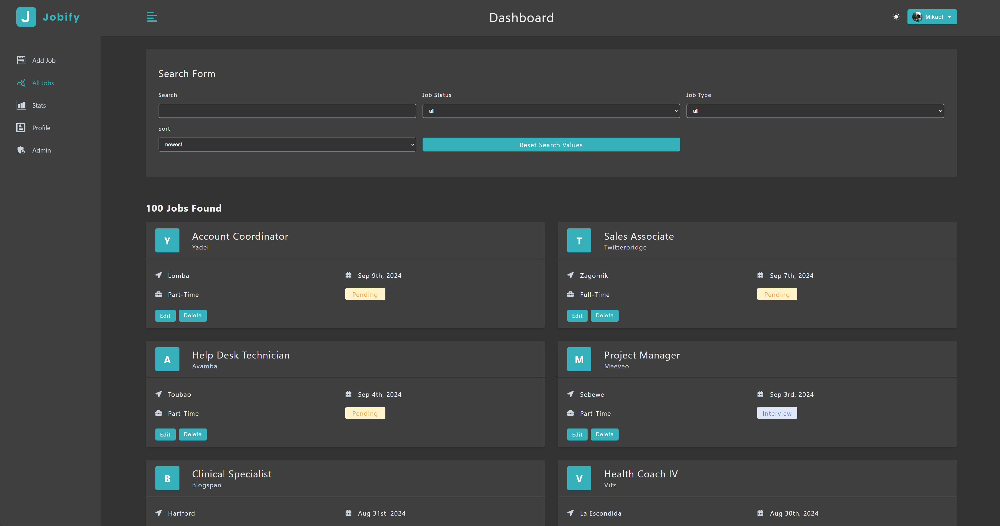

# My Jobify MERN

**Disclaimer**: This project is based on the [MERN 2024 Edition - MongoDB, Express, React and NodeJS](https://www.udemy.com/course/mern-stack-course-mongodb-express-react-and-nodejs) John Smilga's course. The primary purpose of this repository is for personal learning and practice. All credit for the original design and concepts goes to John Smilga. This repository serves as my implementation of the project following the course.

## Overview
Welcome to My Jobify App! You can track your job applications, view stats, and manage your profile easily with this app. Explore the app with sample data before signing up. Perfect for staying organized in your job search.

## Technologies Used
- React
- MongoDB
- Express.js
- Node.js
- Styled Components

## How to Run the Project
1. Install the packages
```
npm install
```
2. Run the application
```
npm run dev
```

### Usage

## Public part

- **Home page**
<br />The landing page of My Jobify, where users can register or log in. Demo users can explore the app without registration, experiencing the core features with generated sample data.


- **Add Job Page**
<br />On this page, users can add new job applications by entering details such as position, company, location, job status, and type. It provides an intuitive interface for organizing job application details.


- **All Jobs Page**
<br />This page displays a list of all added job applications, which can be sorted by various criteria. Users can edit or delete jobs, except for demo users, who can only view the data. The interface is clean and easy to navigate.


- **Stats Page**
<br />This page displays job application data in visually appealing charts and diagrams. Users can see job status breakdowns (e.g., pending, interviews, declined) and track the number of applications submitted over the last six months with area and bar charts.


- **Profile Page**
<br />On the profile page, users can update their personal information, including name, email, and location, and upload a profile picture. This feature enhances user experience by making profile management easy and convenient.


## Private part

- **Admin Page**
<br />Accessible only to admin users, this page shows a list of all users and the total number of job applications across the platform. It provides an organized and user-friendly overview of key data for admin management.

